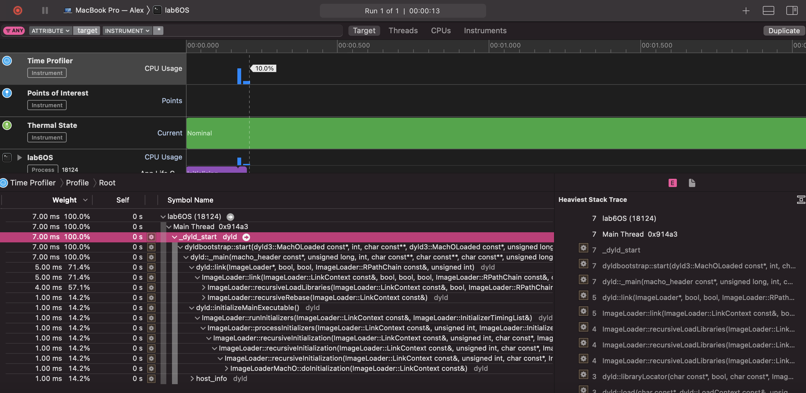
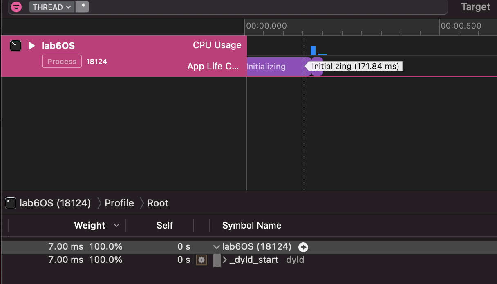
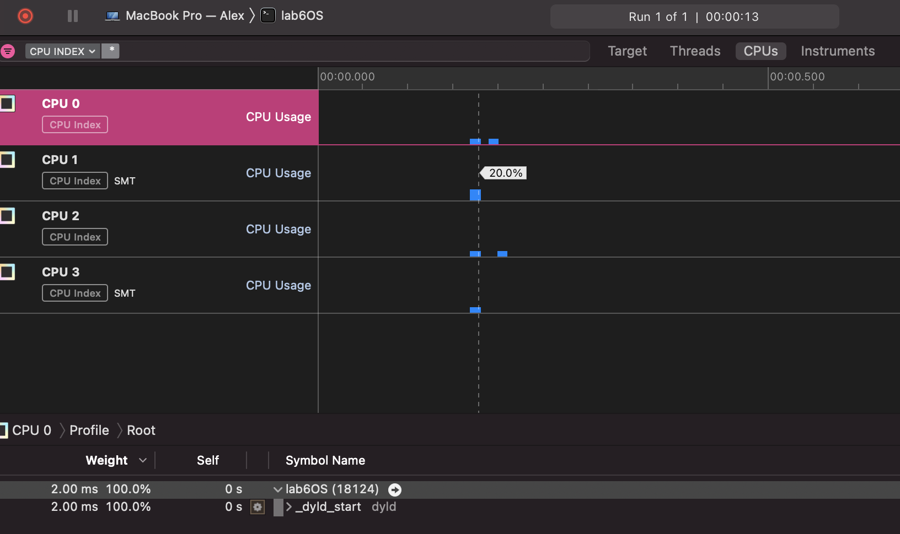

<h1>
    Profiler
</h1>

We need to check our code. Our functions drawSquare() and drawCircle() create matrix 1000 * 1000. Then we iterate over all elements and switch our thread state into waiting by 1 second on every increment.

   Code:
  

    void DrawCircle()
    {
        unsigned long circle[1000][1000];
        for(int i = 0; i < 1000; i++)
        {
            //process of drawing
            this_thread::sleep_for(chrono::milliseconds(1000));
            for (int j = 0; j < 1000; j++) {
                circle[i][j] = i * j;
            }
        }
    
    }
    
    void DrawSquare()
    {
        cout<<"ddd";
        unsigned long int square[1000][1000];
        for(int i = 0; i < 1000; i++)
        {
            //process of drawing
            this_thread::sleep_for(chrono::milliseconds(1000));
            for (int j = 0; j < 1000; j++) {
                square[i][j] = i + j;
            }
        }
    }
    
    int main()
    {
        printf("\n Inside main()\n");
        int typeOfShape;
        cout<<"typeOfShape = ";
        cin>>typeOfShape;
        
        int i = 0;
    
        for(;i<0xffffff;i++);
        switch(typeOfShape){
        case 1:
            DrawSquare();
            break;
        case 2:
            DrawCircle();
            break;
        }
    
        return 0;
    }
    
I did it with Xcode Profiling. You can see it bellow:

